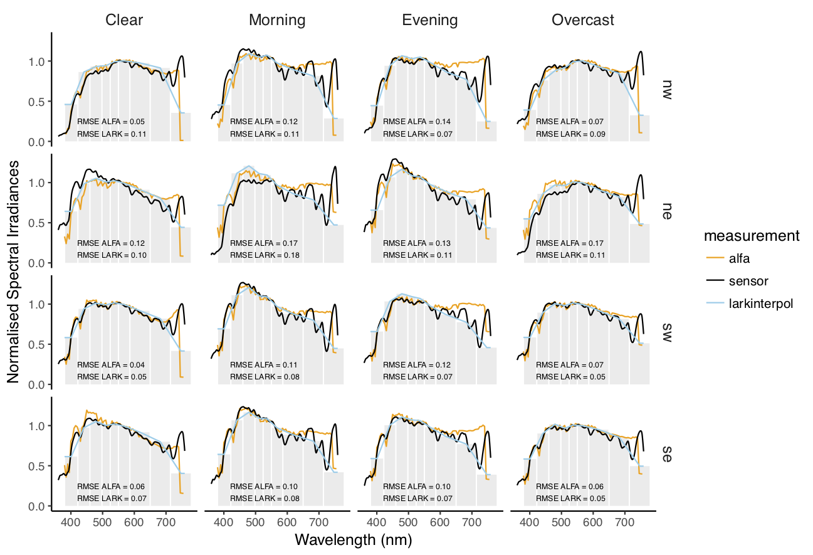
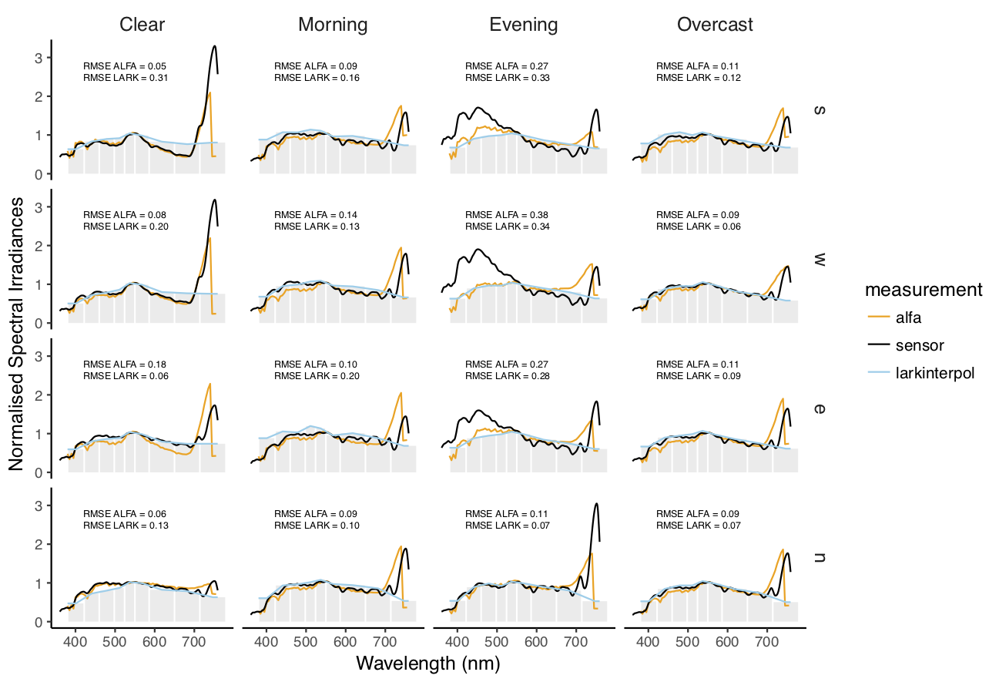
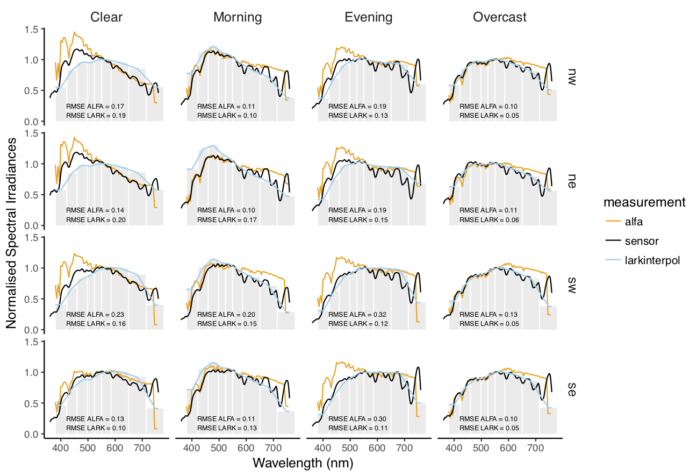

# Spectral irradiance comparisons
Comparisons of measured spectral irradiance with spectral outputs from LARK and ALFA

## Terms of use
For use of these images, kindly cite the conference paper *Spectral Rendering with Daylight: A Comparison of Two Spectral Daylight Simulation Platforms*

```
@inproceedings{balakrishnan2019spectral,
    author  = "Balakrishnan, Priji and Jakubiec, J Alstan" ,
    title   = "Spectral Rendering with Daylight: A Comparison of Two Spectral Daylight Simulation Platforms",
    booktitle = "Proceedings of the International Building Performance Simulation Association 2019"
    year    = "2019",

}
```

## Contents
The repository has a collection of normalised spectral irradiance comparisons of three urban scenarios having different materiality.

- **plaster**:  outdoor environment enclosed with plaster facades
- **green**: outdoor environment enclosed with trees and grass ground cover
- **reflective**: outdoor environment enclosed with reflective glass facade.

The three urban scenarios are measured in Singapore under four different sky conditions *'clear', 'morning', 'evening', 'overcast'*. More details on the sky conditions, measurement set-up and recorded spectral irradiance of the skies can be found in the [equatorial skies repository](https://github.com/prijibalakrishnan/equatorialskies)

The upcoming conference publication *Spectral Rendering with Daylight: A Comparison of Two Spectral Daylight Simulation Platforms* has detailed information on the measurement set-up in the three urban environments and comparison between [LARK](http://faculty.washington.edu/inanici/Lark/Lark_home_page.html) and [ALFA](https://solemma.com/Alfa.html), the two currently available spectral daylight simulation platforms.

## Spectral Irradiance Comparisons


Normalised spectral irradiance comparisons between sensor, LARK and ALFA in all directions and the four sky conditions in the plaster environment.


Normalised spectral irradiance comparisons between sensor, LARK and ALFA in all directions and the four sky conditions in the green environment.


Normalised spectral irradiance comparisons between sensor, LARK and ALFA in all directions and the four sky conditions in the reflective environment.
